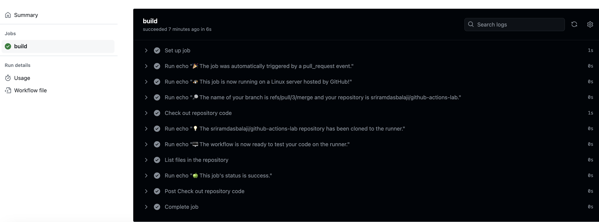

## Creating your first Action Workflow

### Overview
GitHub Actions is a continuous integration and continuous delivery (CI/CD) platform that allows you to automate your build, test, and deployment pipeline. You can create workflows that run tests whenever you push a change to your repository, or that deploy merged pull requests to production.

In this hands-on lab your will create your first GitHub Action Workflow and learn how you can use Actions to automate tasks in your software development lifecycle. 

If you like more background information, please refer to the [GitHub Actions](https://docs.github.com/en/actions/learn-github-actions/understanding-github-actions) pages on GitHub Docs.

In this lab, you will:

- Create a repository.
- Creating the workflow
- Viewing your workflow results
- Scheduling the runs


### Prerequisites

- You must have a GitHub account. If you don't have, see "[Creating an account on GitHub.](https://docs.github.com/en/get-started/start-your-journey/creating-an-account-on-github)"

### Task 1: Create a GitHub Repository

A repository is the most basic element of GitHub. It's a place where you can store your code, your files, and each file's revision history.

1. Navigate to https://github.com/ and Sign in.
1. After Sign in, in the left side upper corner of the page, selct **New** (OR) in the upper-right corner of  page, select **+**, then click **New repository**.

   

1. In `Create a new repository` page, in the "Repository name" box, type `github-actions-lab`.

1. In the **Description** box, type a short description. For example, type "This repository is for practising the GitHub actions."

1. For this exercise please select visibility as **Public**

1. Select **Add a README file**.

1. Click **Create repository**.

     


### Task 2: Enabling GitHub Actions

Below are the basic components of a GitHub Actions workflow file. 
In short, an event triggers the workflow, which contains a job. This job then uses steps to dictate which actions will run within the workflow. 


1. Navigate to **Actions** tab in your repository.

   > GitHub provides preconfigured starter workflows that you can customize to create your own continuous integration workflow. GitHub analyzes your code and shows you CI starter workflows that might be useful for your repository. For example, if your repository contains Node.js code, you'll see suggestions for Node.js projects

1. For this exercise we will setup our own workflow. Choose **set up a workflow yourself**

    

1. As you can see this will create a workflow file in `.github/workflows`. Rename the file to `CI.yml`  and copy the following YAML contents into the `CI.yml` file. Click **Commit changes**.

     

```YAML
# This is a basic workflow to help you get started with Actions
name: CI
run-name: ${{ github.actor }} is testing out GitHub Actions 🚀
# Controls when the workflow will run
on:
# Triggers the workflow on push or pull request events but only for the "main" branch
    push:
        branches: [ "main" ]
    pull_request:
        branches: [ "main" ]

# Allows you to run this workflow manually from the Actions tab
    workflow_dispatch:

# A workflow run is made up of one or more jobs that can run sequentially or in parallel
jobs:
# This workflow contains a single job called "build"
    build:
# The type of runner that the job will run on
        runs-on: ubuntu-latest

    # Steps represent a sequence of tasks that will be executed as part of the job
        steps:
        - run: echo "🎉 The job was automatically triggered by a ${{ github.event_name }} event."
        - run: echo "🐧 This job is now running on a ${{ runner.os }} server hosted by GitHub!"
        - run: echo "🔎 The name of your branch is ${{ github.ref }} and your repository is ${{ github.repository }}."
        - name: Check out repository code
          uses: actions/checkout@v4
        - run: echo "💡 The ${{ github.repository }} repository has been cloned to the runner."
        - run: echo "🖥️ The workflow is now ready to test your code on the runner."
        - name: List files in the repository
          run: |
            ls ${{ github.workspace }}
        - run: echo "🍏 This job's status is ${{ job.status }}."


```

    
2. In the "Propose changes" dialog, select the option to create a new branch and start a pull request. Then click  **Propose changes**.
    
    


3. Committing the workflow file to a branch in your repository triggers the `push` event and runs your workflow.


### Task 3: Viewing your workflow results

1. Under your repository name, click **Actions**.

    

1. In the left sidebar, click the workflow you want to display, in this example **CI**.
    
    

1. From the list of workflow runs, click the name of the run you want to see, in this example "USERNAME is testing out GitHub Actions."

1. In the left sidebar of the workflow run page, under Jobs, click the **build** job.
    
     

1. The log shows you how each of the steps was processed. Expand any of the steps to view its details.
     
     

    For example, you can see the list of files in your repository:
     
     


### Task 4: Configure workflows to run for scheduled events

You can configure your workflows to run when specific activity occurs on GitHub, when an event outside of GitHub happens, or at a scheduled time. Please see [Events that trigger workflows](https://docs.github.com/en/actions/using-workflows/events-that-trigger-workflows)


1.  if you wanted to run a workflow every 15 minutes, the schedule event would look like the following:

```yaml
on:
  schedule:
    - cron:  '*/15 * * * *'
```
2. if you wanted to run a workflow every Sunday at 3:00am, the schedule event would look like this:

```yaml
on:
  schedule:
    - cron:  '0 3 * * SUN'
```

As part of this lab, you've learned

- How to create the workflow
- Viewing your workflow results
- How to schedule the runs


### If time permits do below exercise

- Exercise 2: [Create a Deployment workflow](/labs/deploymentworkflow.md)