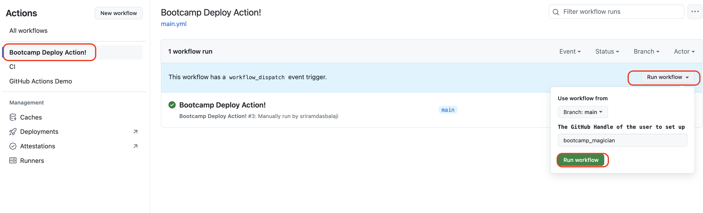
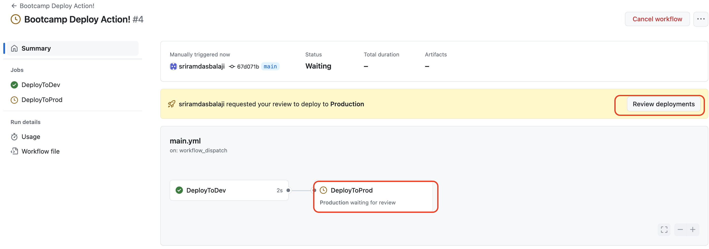

### Creating Deployment workflow

In this hands-on lab your will create simple deployment workflow using environments . If you like more background information, please refer to the [GitHub Codespaces](https://docs.github.com/en/codespaces) pages on GitHub Docs.


### Task 1 : Create a Dev Evironment
1. On GitHub, navigate to the main page of the repository.
2. Click `Settings` 
3. In the left sidebar, click `Environments`
4. Click `New Environment`
5. In the `Name` field type `Dev`
6. Click `Configure Environment`
7. Click `Save Protection rules`

### Task 2: Create a Production Evironment
1. In the left sidebar, click `Environments`
2. Click `New Environment`
3. In the `Name*` field type `Production`
4. Click `Configure Environment`
5. Select `Required Reviewers` checkbox
6. Add yourself as a review
7. Click `Save Protection rules`

### Task 3: Add the following workflow
1. On GitHub, navigate to the main page of the repository.
2. Select `Actions`
3. Select `New Workflow`
4. Select `Set up a workflow yourself`
5. Name the file `deploy.yml`
6. Paste in the following code:
```yaml
###################################################################
#Deploy action

# GitHub displays the names of your workflows on your repository's actions page
name: Bootcamp Deploy Action! 

# Controls when the workflow will run
on:   
  # Allows you to run this workflow manually from the Actions tab
  workflow_dispatch:
    inputs:
      ghhandle:
        description: 'The GitHub Handle of the user to set up'
        default: 'bootcamp_magician'
        type: string
           
# A workflow run is made up of one or more jobs that can run sequentially or in parallel
jobs:
  # This workflow contains a single job called "build"
  DeployToDev:
    # The type of runner that the job will run on
    runs-on: windows-latest
    environment: Dev
        
    # Steps represent a sequence of tasks that will be executed as part of the job
    steps:
      # Runs a single command using the runners shell
      - name: Deploying To Dev for ${{ inputs.ghhandle }}!
        run: "echo I just deployed to Dev"

  DeployToProd:
    runs-on: windows-latest
    needs: DeployToDev
    environment: Production
    
    steps:
      - name: Deploying To Production for ${{ inputs.ghhandle }}!
        run: "echo I just deployed to Production"
###################################################################
```

7. Commit changes directly to main branch

8. Now you can see  **Bootcamp deploy action** in the **Actions** tab.

9. Since we have added Manual 'workflow_dispatch' event as trigger type, we can trigger this manually only. Click **Run Workflow**

     

10. When the job is triggered for Production environment tasks, it will ask for review. You need to approve to continue with the execution.

     